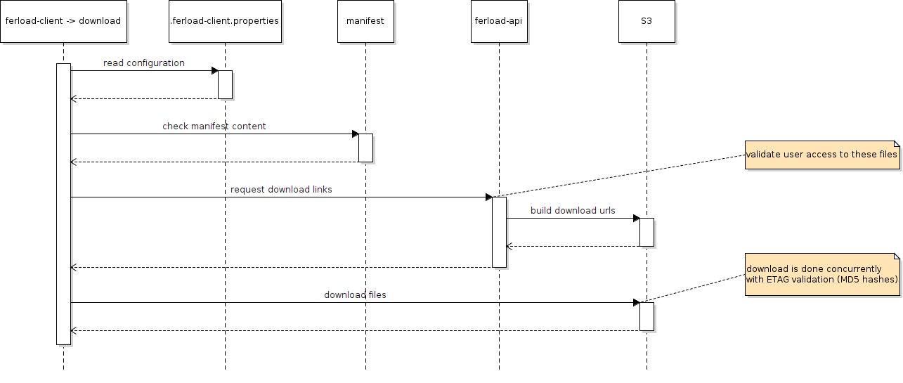
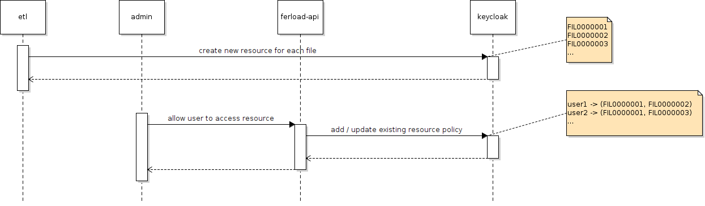

# ferload-client-cli

Official Ferload Client command line interface for files download.

This tool requires JRE >= 8, you can verify the installed version using the following:

```shell
java -version
```

# Installation

- Go to the [releases](https://github.com/Ferlab-Ste-Justine/ferload-client-cli/releases) page
- Download the last one (or a specific version)
- In **Assets** click on the **ferload-client** file
*(your browser may ask to confirm the download)*
- Once it's downloaded give execution right to the file with the following:

```
user@localhost:~$ chmod +x ./ferload-client

```

# User guide

This tool provides several commands and by default will display usage if none specified:

```
user@localhost:~$ ./ferload-client

```

Should display:

```
Usage: ferload-client [-hV] [COMMAND]
Official Ferload Client command line interface for files download.
  -h, --help      Show this help message and exit.
  -V, --version   Print version information and exit.
Commands:
  configure   Help configure this tool.
  download   Download files based on provided manifest.
```
## Configure

Will ask the user to enter step by step the required information needed to configure the tool.

*Note: This step has to be done at least once and will be prompted if not done before download*

### Usage

```
Usage: ferload-client configure [-hrV] [-f=<ferloadUrl>] [-u=<username>]
 Help configure this tool.
  -f, --ferload-url=<ferloadUrl>
                  Ferload url
  -h, --help      Show this help message and exit.
  -r, --reset     Reset configuration (default: false)
  -u, --username=<username>
                  username
  -V, --version   Print version information and exit.
```

All the params are optional if not provided user will access interactive prompts.

### Example

```
user@localhost:~$ ./ferload-client configure

Welcome to Ferload Client, this tools will download
the files based on the provided manifest.

Press 'enter' to keep the existing configuration [current].

Ferload url                 [http://localhost:9001]: 
username                                    [user1]: 

Retrieve Ferload configuration ✅

Configuration has been successfully updated ✅

```

*Note: configure will display current existing configuration values, user doesn't have to re-write them again, just press 'enter' if the value didn't changed*

## Download
By providing a manifest file and an output folder the tool will start downloading the files. This step is done concurrently with a secured hash validation for file integrity.
### Usage
```
Usage: ferload-client download [-hV] [-m=<manifest>] [-o=<outputDir>]
                               [-p=<password>]
Download files based on provided manifest.
  -h, --help      Show this help message and exit.
  -m, --manifest=<manifest>
                  manifest file location (default: manifest.tsv)
  -o, --output-dir=<outputDir>
                  downloads location (default: .)
  -p, --password=<password>
                  password
  -V, --version   Print version information and exit.
```

Manifest and output folder have default values. User can provide specific ones if needed.

### Example
```
user@localhost:~$ ./ferload-client download -m ./data/m1.tsv -o ./data

Welcome to Ferload Client, this tools will download
the files based on the provided manifest.

Checking manifest file                             ✅

password                                   [hidden]:

Retrieve user credentials                          ✅

Retrieve Ferload download link(s)                  ✅

Compute total average expected download size       ✅

The total expected average download size will be 4 GB do you agree ? [yes]:

FIL0000010 [##################################################]      0 /      0 MB (100%) 📦
FIL0000002 [##################################################]    125 /    125 MB (100%) 📦
FIL0000008 [##################################################]    225 /    225 MB (100%) 📦
FIL0000005 [##################################################]    200 /    200 MB (100%) 📦
FIL0000009 [##################################################]    500 /    500 MB (100%) 📦
FIL0000003 [##################################################]     75 /     75 MB (100%) 📦
FIL0000004 [##################################################]     50 /     50 MB (100%) 📦
FIL0000007 [##################################################]    175 /    175 MB (100%) 📦
FIL0000011 [##################################################]   1024 /   1024 MB (100%) 📦
FIL0000012 [##################################################]   2048 /   2048 MB (100%) 📦
FIL0000001 [##################################################]    100 /    100 MB (100%) 📦
FIL0000006 [##################################################]    150 /    150 MB (100%) 📦

Total downloaded files: 12 located here: ./data

```
# Technical

## Manifest file

This file is downloaded by the user from the portal or received by email.

Example of content:

```
file_id
FIL0000001
FIL0000002
FIL0000003
FIL0000004
FIL0000005
FIL0000006
FIL0000007
FIL0000008
FIL0000009
FIL0000010
FIL0000011
FIL0000012
```
## Sequence diagrams

### Configure


### Download

## Dependencies

|technology|link|details|
|-|-|-|
|JAVA|https://openjdk.java.net/install|8|
|scala|https://www.scala-lang.org|2.x|
|picocli|https://picocli.info/|command-line library|
|config|https://github.com/lightbend/config|to manage internal configuration|
|keycloak|https://www.keycloak.org/documentation.html|JAVA API to access Keycloak|
|AWS S3 v1|https://docs.aws.amazon.com/sdk-for-java/v1/developer-guide/examples-s3-transfermanager.html|Used for TransferManager mainly|
|Apache HTTP client|https://hc.apache.org/httpcomponents-client-4.5.x|To perform HTTP calls|
|Apache CSV|https://commons.apache.org/proper/commons-csv|Manipulate CSV files|
|Apache IO|https://commons.apache.org/proper/commons-io|Files and IO utils|
|JSON-Java|https://github.com/stleary/JSON-java|Help working with JSON|

## Access rights 

The following sequence diagram explains how the access rights are granted for each user. 

*Note: This part isn't done by this tool but is required otherwise the user will not be allowed to download the files.*



Example of forbidden message if not sufficient rights:

```
No enough access rights to download the following files, code: 403, message:

FIL0000004
FIL0000001
```

## Release

The following command will release a new version of the tool:

```
git tag v?.?.?
git push origin v?.?.?
```

*Note: don't use the Github release UI as it will be in conflict with the pipeline script.*