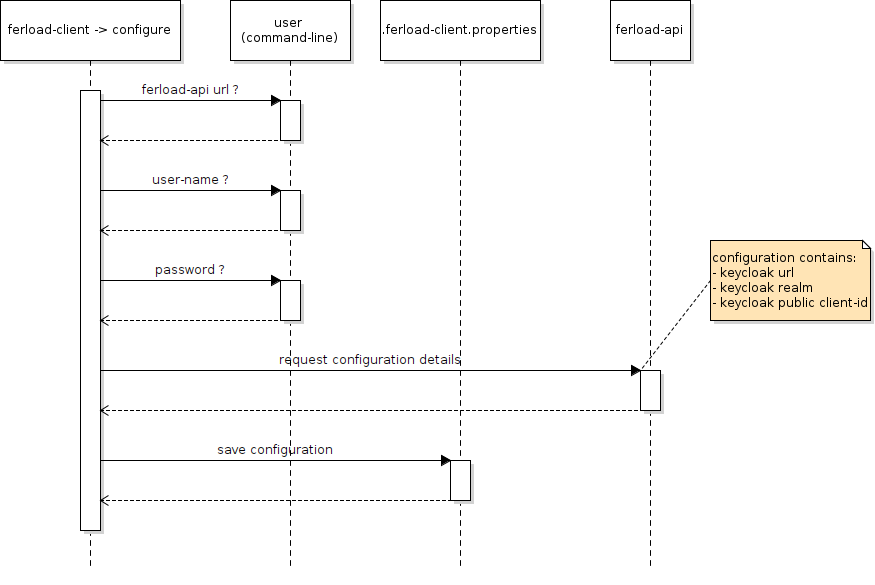

# ferload-client-cli

Official Ferload Client command line interface for files download.

|technology|link|details|
|-|-|-|
|scala|https://www.scala-lang.org|2.x|
|picocli|https://picocli.info/|command-line library|
|config|https://github.com/lightbend/config|to manage internal configuration|
|keycloak|https://www.keycloak.org/documentation.html|JAVA API to access Keycloak|
|AWS S3 v1|https://docs.aws.amazon.com/sdk-for-java/v1/developer-guide/examples-s3-transfermanager.html|Used for TransferManager mainly|
|Apache HTTP client|https://hc.apache.org/httpcomponents-client-4.5.x|To perform HTTP calls|
|JSON-Java|https://github.com/stleary/JSON-java|Help working with JSON|

# Commands

This tool provide several commands and by default will display usage if not specified:

```
Usage: ferload-client [-hV] [COMMAND]
Official Ferload Client command line interface for files download.
  -h, --help      Show this help message and exit.
  -V, --version   Print version information and exit.
Commands:
  configure   Help configure this tools.
  download   Download files based on provided manifest.
```
## Configure

Will ask the user to enter step by step the required information needed to configure the tool.

*Note: This step has to be done at least once and will be prompted if not done before download*

### Usage

```
Usage: ferload-client configure [-hrV] [-f=<ferloadUrl>] [-p=<password>]
                                [-u=<username>]
 Help configure this tools.
  -f, --ferload-url=<ferloadUrl>
                  Ferload url
  -h, --help      Show this help message and exit.
  -p, --password=<password>
                  password
  -r, --reset     Reset configuration (default: false)
  -u, --username=<username>
                  username
  -V, --version   Print version information and exit.
```
### Sequence diagram


## Download
By providing a manifest file and an output folder the tool will start downloading the files. This step is done concurrently with a secured hash validation for file integrity.
### Usage
```
Usage: ferload-client download [-hV] [-m=<manifest>] [-o=<outputDir>]
Download files based on provided manifest.
  -h, --help      Show this help message and exit.
  -m, --manifest=<manifest>
                  manifest file location (default: manifest.tsv)
  -o, --output-dir=<outputDir>
                  downloads location (default: .)
  -V, --version   Print version information and exit
```
### Sequence diagram


# Access rights 

The following sequence diagram explains how the access rights are granted for each user. 

*Note: This part isn't done by this tool.*


